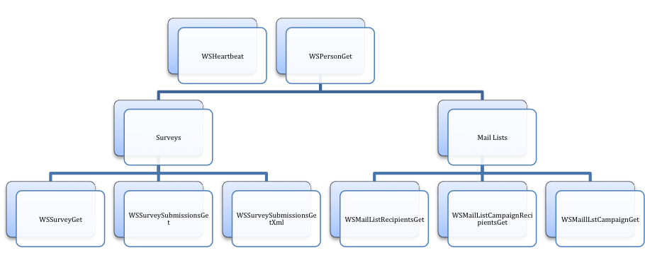

Title:		Using Vovici API in SAS&reg; 9.2 
Author:		Richard Koopmann
Company:	Capella University
City:		Minneapolis, MN

Abstract
========

With the release of SAS 9.2, programmers were able to communicate directly with third-party services via two new procedures (depending on the type of service being accessed): the HTTP procedure for Representational State Transfer (REST) Protocol-based services, the SOAP procedure for Simple Object Access (SOA) Protocol-based services. Given these tools, SAS can interact with data on remote servers directly.

The current paper demonstrates how the SOAP procedure is being employed for more automated ETL processes from Vovici, a third-party survey hosting service, using the SOA Protocol. The returned xml-based survey results, when paired with the xml-based survey definition, are used as input for regular reporting processes.

Introduction
============

Capella University uses Vovici's EFM Continuum as the primary tool for regular and ad-hoc data collection efforts (e.g., alumni surveys, end of course evaluations, and specific accreditation efforts). Surveys are developed and edited within the end-user's web browser; submissions can be analyzed online and raw submission can be downloaded in plain text format for more in-depth analysis and reporting.

Vovici offers customers a SOAP-based end-user Application Program Interface (API) for accessing data related to their surveys and campaigns as well as an administrator API for accessing data related to subaccounts; this paper focuses on the end-user API.

The [WSWebTopSvc](http://desktop.vovici.com/WSWebTopSvc.asmx) service offers end-users several actions to perform on different targets. For example, end-users can toggle the accessibility of existing surveys, retrieve the definition of existing surveys, and get survey submissions either individually or en masse.

Once a survey has been developed, the survey definition can be pulled into SAS to set up and apply the formats and informats as well as apply any recoding. Data sets can then be kept in the WORK library or moved to a permanent library.

Macro Overview
==============

1.	Identify web service and specify relevant parameters
2.	Call SOAP procedure for specified web service
3.	Preprocess returned XML with PERL (optional)
4.	Create/Replace relevant data sets to WORK library via XML libname engine and map
5.	Modify and create additional SAS data sets, formats, and informats (optional)
6.	Clean up request, response, and parsed response files (optional)

Identify Web Service
--------------------

The macro itself requires only one parameter: which of the 26 parameters the request is for. For each of the 26 web services, an additional set of required parameters.

Call Soap Procedure
-------------------

For the 11 web services that have been implemented, SAS generates the corresponding request from a template text file created ahead of time. The request template has macro variables referencing macro parameters relevant to the web service being called. Those macro variables are resolved and the request is written to a file, which is sent via the SOAP procedure.

Here's an example request template for one of the web services:

		<soapenv:Envelope xmlns:soapenv="http://schemas.xmlsoap.org/soap/envelope/"
		 xmlns:efm="http://desktop.vovici.com/EFMWebTopSvc">
		   <soapenv:Header>
			  <efm:WSAuthHeader>
				 <efm:User>&USER</efm:User>
				 <efm:Password>&PASSWORD</efm:Password>
			  </efm:WSAuthHeader>
		   </soapenv:Header>
		   <soapenv:Body>
			  <efm:WSSurveySubmissionsGetXml>
				 <efm:surveyId>&SURVEYID</efm:surveyId>
				 <efm:startDate>&STARTDATE</efm:startDate>
				 <efm:recordLimit>&RECORDLIMIT</efm:recordLimit>
				 <efm:getIncompleteResponses>&GETINCOMPLETERESPONSES</efm:getIncompleteResponses>
			  </efm:WSSurveySubmissionsGetXml>
		   </soapenv:Body>
		</soapenv:Envelope>

In the code above, the web service parameters and macro variables are in the following format: `<efm:parameter>&VARIABLE</efm:paramter>`.

Preprocess With Perl
--------------------

Responses from some of the web services return XML that the XML Mapper, XML Notepad, and XML Libname Engine were unable to process. Fortunately PERL is a capable tool for systematic edits/extractions. Currently, there are five types of edits which responses from a given web service may need:

- Remove internal line breaks
- Encode HTML characters
- Replace "pretty" characters (e.g., curly quotes, em dashes)
- Extract encapsulated XML
- Remove CDATA elements

Create/Replace SAS Data Sets
----------------------------

Before copying data sets from the response XML library, any existing data sets of the same name are deleted to avoid ambiguity; if the macro call fails before copying all relevant SAS data sets, how would one know which are from the most recent call (Always assume users don't read the log as much as they should).

Modify/Create Data Sets
-----------------------

Often a given web service response will generate multiple SAS data sets. The macro returns or creates a _Main data set for each of the web services implemented. In some cases, however, additional data sets are generated to assist in later calls or transformations and transpositions are made to create "flat" tables and perform standard calculations, which help to ease analysis.

Survey definition-based web services generate formats and informats for most survey items. These formats and informats are used by calls to submission-based web services for creating more efficient SAS data sets.

Clean Up
--------

By default, the macro will attempt to clean up as many artifacts as it can. For debugging, however, these files can always be retained.

Typical Order Of Calls
======================

 
The WSHeartbeat web service can be used to check the availability of the web services; a successful request will return the current datetime stamp from the server.

Typically the analyst will need to get a high-level overview of the end user's Vovici account with WSGetPerson. This call generates a data set listing all the surveys under their account as well as any mailing lists they may have.

From the survey side of things, the analyst can pull survey definitions for a specific survey, pull submissions received for a given survey since a specified datetime, or pull a specific submission to a survey.

From the mail list side of things, the analyst can pull information about a given campaign including the content of each message within a campaign, which survey each campaign was targeting, as well as a listing of recipients for a given campaign and datetime stamps for delivery and click information.

Example
-------

		option noxwait;
		
		%let wsUser=USERNAME; * Vovici credentials ;
		%let wsPass=PASSWORD;
		
		%inc 'programs\ws.sas'; * compile macro ;
		
		%WS(WSPersonGet); * get basic information ;
		
		%WS(WSSurveyGet, SurveyID=585); * pull survey definition ;
		
		proc sql; * determine when submissions data sets was last updated ;
			select s format=IS8601DT. /*yyyy-mm-ddThh:mm:ss*/
			into :lastSubmit
			from cules.Submit_lastupdated;
		quit;
		
		%WS(WSSurveySubmissionsGetXml, SURVEYID=585, STARTDATE=&LASTSUBMIT, RECORDLIMIT=5000);
		
		* perform transformations ;
		data wsssgx_data(drop=_:);
			format
				SurveyID 8.
				UniqueID $50.
				K 8.
				S datetime19.
				RemoteAddr $15.
				WEM $50.;
			set wsssgx_data(rename=(&RENAME_LIST) drop=&HIDDEN_LIST);
			&RECODE_LIST;
		run;
		
		* append submissions in permanent library ;
		proc datasets library=CULES nodetails nolist;
			append base=CULES.submit2010
				data=WORK.wsssgx_data
				force; * be careful when forcing appends ;
			run;
		quit;
		
		* note when the last submission was submitted for future appends ;
		proc summary data=wsssgx_data(keep=S);
			var S;
			output out=cules.Submit_lastupdated(keep=S) max=;
		run;

With 4 statements, 4 steps, and 3 macro calls, the following big events occur:

- The macro is compiled and standard parameters are set.
- An overview of the end user account is pulled---note that once the SAS program has been tested, this macro call is not needed.
- The definition for the desired survey is pulled and custom formats/informats are generated.
- The code checks when the last submissions received were collected.
- Pull down subsequent submissions and make transformations based on the survey definition.
- Append the current submissions to the permanent library taking note of when the latest submission was received.

There is no need to hand code custom formats/informats, import scripts, and data set definitions as that is handled by the macro.

Conclusion
==========

The benefit of a macro approach over individualized scripts is scalability. Before, a SAS program was developed for each survey based on the questions and responses contained within that survey. Updates to the submissions were based on the end users performing the same steps each time they wanted new results. With the macro approach, surveys can be developed by end users as before, but the time to develop the underlying SAS programs has dropped to minutes rather than hours. Additionally, updates are a quick few minutes of the analysts' time without leaving their SAS session.

Resources
=========

[soapUI](http://soapui.org) was used to help develop valid requests. These became templates for all requests using the same service.

[XML Notepad 2007](http://www.microsoft.com/download/en/details.aspx?id=7973) was used to help view responses (including PERL-processed responses).

Source Code
===========

All source code is maintained on the author's Github repository: [https://github.com/rkoopmann/vovici_api_sas]().

Contact Information
===================

Your comments and questions are valued and encouraged. Contact the author at:

Richard Koopmann  
Capella University  
Minneapolis, MN 55402  
richard.koopmann@capella.edu

SAS and all other SAS Institute Inc. product or service names are registered trademarks or trademarks of SAS Institute Inc. in the USA and other countries. &reg; indicates USA registration.

Other brand and product names are trademarks of their respective companies. 

